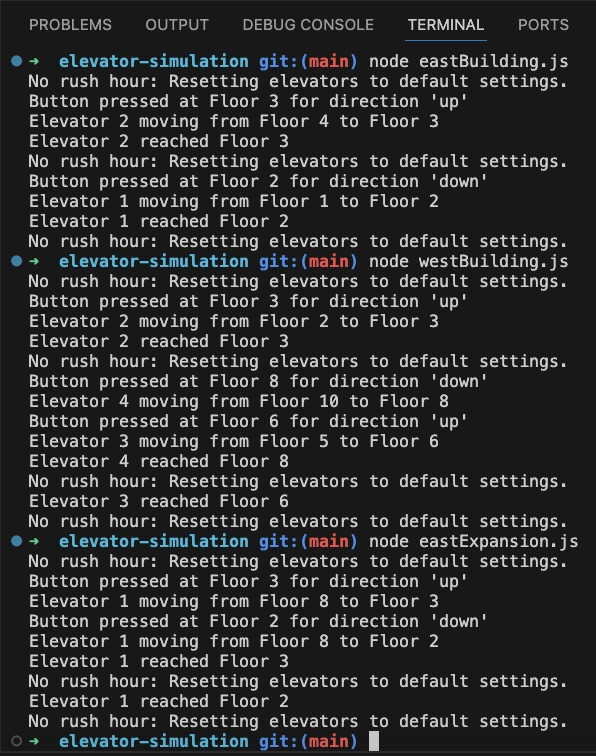

# Elevator System Simulator

This project simulates elevator operations across multiple scenarios. It provides a highly modular and extensible design for managing elevator behaviors, traffic flow patterns, and elevator requests.

## Project Overview

The repository contains code for simulating elevators in three scenarios:
1. `eastBuilding.js`
2. `westBuilding.js`
3. `eastExpansion.js`

Each file encapsulates the logic and configurations specific to the scenario it represents, including the number of floors, elevators, and traffic flow patterns.

---

### **File Descriptions**

#### `eastBuilding.js`
**Description:** This file models the elevator system for a **4-floor building** with **2 elevators**.  
- **Elevators:** Each elevator starts on a specific idle floor (`Floor 1` for Elevator 1 and `Floor 4` for Elevator 2) with a default idle direction.  
- **Traffic Flow:** The system adapts to **morning** and **evening rush hours**, with elevators pre-configured to move in specific directions during high traffic times.
- **Unique Features:**
  - Morning rush: Elevator 1 operates exclusively **upward**.
  - Evening rush: Elevator 2 operates exclusively **downward**.
- **Simulation Highlights:** Includes examples of button presses and their effect on elevator movements.

#### `westBuilding.js`
**Description:** This file models the elevator system for a **10-floor building** with **4 elevators**.  
- **Elevators:** The elevators start on floors `1`, `2`, `5`, and `10`, each with its own idle direction and state.  
- **Traffic Flow:** The system adapts to **rush hours**:
  - Morning rush: Elevators 1 and 2 are configured to move **upward only**.
  - Evening rush: Elevator 3 moves to an idle position at `Floor 9` and operates exclusively **downward**, alongside Elevator 4.
- **Unique Features:**
  - Traffic flow is adjusted for longer travel distances and more complex patterns due to the higher number of floors and elevators.
- **Simulation Highlights:** Provides extensive sorting logic for selecting the most appropriate elevator for a request.

#### `eastExpansion.js`
**Description:** This file models the elevator system for a **24-floor building** with **2 elevators**.  
- **Elevators:**  
  - Elevator 1 starts idle on `Floor 8`.  
  - Elevator 2 starts idle on `Floor 17`.  
- **Traffic Flow:** The system dynamically adjusts elevator behavior based on traffic demand, with the following configurations:  
  - **Morning Rush (7:30 AM - 9:30 AM):** Elevator 1 is set to **"up" only** and idles at Floor 1. Elevator 2 is set to idle at Floor 12.
  - **Evening Rush (3:30 PM - 5:30 PM):** Elevator 2 operates **downward only** and idles at Floor 24. Elevator 1 idles at Floor 13.
- **Simulation Highlights:** Demonstrates elevator behavior during rush hours, including how the system responds to multiple button presses and adjusts operations based on real-time demand.

---

### **Key Features**
- Modular **Elevator Class**: Reusable logic for simulating elevator behaviors, including movement, idle states, and direction control.
- **Traffic Flow Management**: Dynamic adjustments for morning and evening rush hours based on real-world time.
- **Real-Time Requests**: Simulated button presses that trigger elevator responses, complete with console logging for tracking elevator movements.
- **Weight Capacity Handling**: Ensures elevators do not exceed their maximum weight threshold, with retries if no elevators are available.
- **Simulated Weight Capacity Monitoring**: Ensures safe operations.
- **Support for Non-Rush Hours** Elevators reset to default settings when not during a rush hour.

---

### **Usage**
1. Clone the repository:
  ```bash
  git clone https://github.com/dmcote-1991/elevator-simulation.git
  cd elevator-simulation
  ```
2. Run each building's simulation individually:
  ```bash
  node eastBuilding.js
  node westBuilding.js
  node southBuilding.js
  ```
3. Observe the console output to track elevator operations.

---

### **Screenshot of Console Output**

